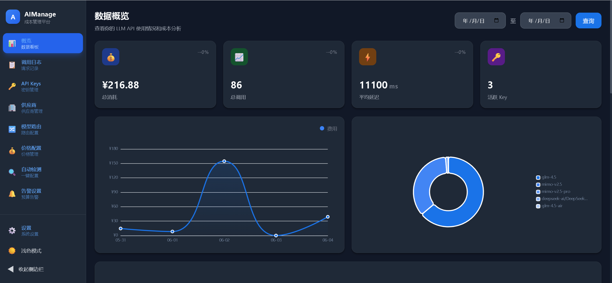
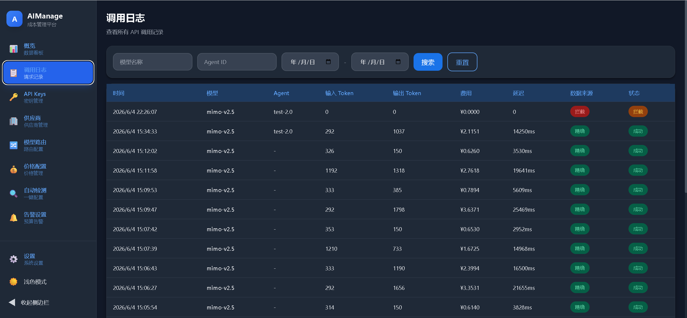
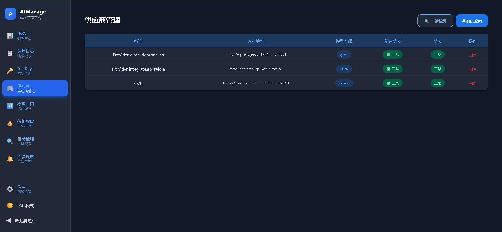
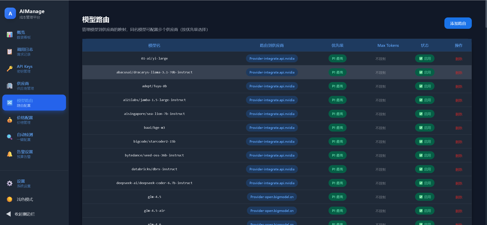
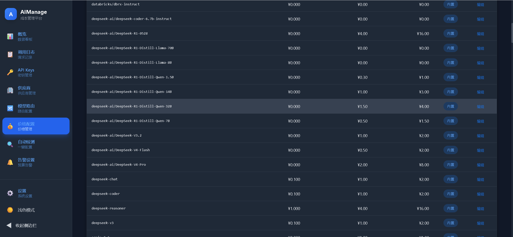
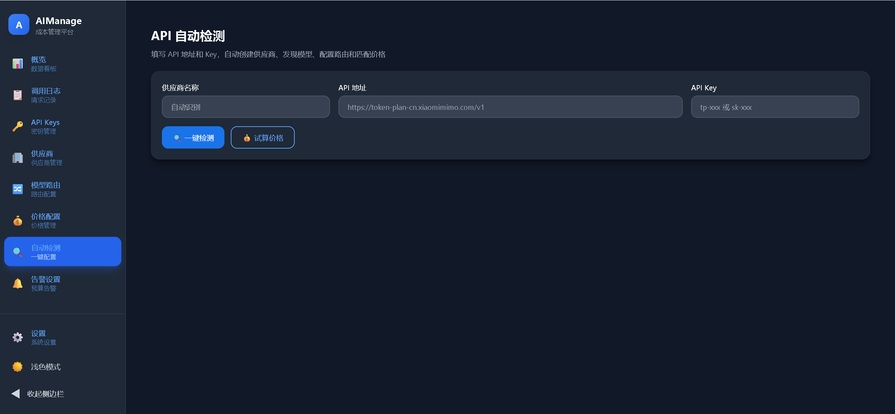
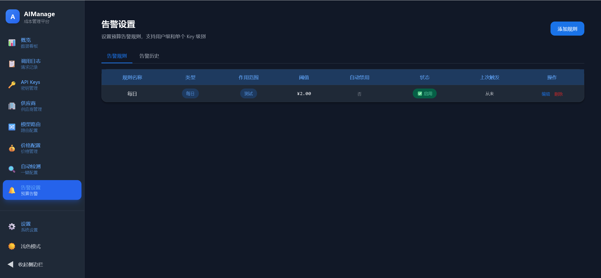

<div align="center">

# ⚡ AIManage

**AI 成本管理中间件 · 统一代理 · 精确计费 · 成本洞察 · 预算告警**  
**AI Cost Management Middleware · Unified Proxy · Accurate Billing · Cost Insight · Budget Alerts**

*让每一次 LLM 调用都可追踪、可分析、可控制*  
*Make every LLM call traceable, analyzable, and controllable*

[](./docker-compose.yml)
[](https://react.dev)
[](https://www.djangoproject.com)
[](https://www.mysql.com)
[](https://redis.io)
[](https://www.typescriptlang.org)
[](https://tailwindcss.com)

[English](#-what-is-this) · [中文](#-这是什么) · [Architecture](./ARCHITECTURE.md)

</div>

---


## 📖 目录

- [这是什么](#-这是什么)
- [核心亮点](#-核心亮点)
- [项目优点](#-项目优点)
- [界面预览](#-界面预览)
- [使用指南](#-使用指南)
- [技术栈总览](#-技术栈总览)
- [技术架构](#-技术架构)
- [核心文件结构](#-核心文件结构)
- [快速开始](#-快速开始)
- [运行要求](#-运行要求)
- [常见问题 FAQ](#-常见问题-faq)
- [安全与生产化建议](#-安全与生产化建议)
- [License](#-license)

---

## 🔍 这是什么？

AIManage 是面向 **AI Agent / LLM 调用场景** 的成本管理中间件。

它不是编排平台的替代品，而是专注于解决团队最常遇到的一个问题：**LLM 花费看不清、控不住、追不回**。

用户或 Agent 只要把 API 地址指向你的网关，就能获得：

- 每次 LLM 调用的 **Token 明细与费用追踪**
- 按 **Agent / 模型 / 时间** 的成本可视化看板
- **预算超限告警**（达到阈值自动通知）
- 团队级 **API Key 管理与权限隔离**

> **一句话定位：不做编排，只做「花钱可控 + 花在哪里清楚」。**

````
传统方式：用户直接调用 LLM API → 花费不可见 → 月底才发现超支
AIManage：用户通过网关调用 → 每笔自动记录 → 成本实时可控
````

---

## 🧠 核心亮点

### 1. 零侵入网关代理

```
用户 / Agent
    ↓ （切换 API 地址即可）
你的网关
    ↓ （自动记录 Token、耗时、费用）
实际 LLM 供应商
```

- **无需改业务代码**，只把 API 地址指向网关即可。
- 支持多供应商、多模型统一入口管理。
- 支持限流、鉴权、审计，降低误用风险。

### 2. 成本全链路追踪

- 自动记录每次调用输入/输出 Token 数量。
- 自动按价格策略计算费用（支持自定义价格表）。
- 支持按 **Agent、模型、时间段** 聚合分析，一眼看清钱花在哪。

### 3. 预算告警

- 设定预算阈值（日/月/总额），超限自动告警。
- 支持 Webhook 推送（企微、钉钉等）。
- 适合团队成本治理、项目费用封顶、异常消耗预警。

### 4. 团队协作友好

- Key 隔离、权限控制、审计可追溯。
- 支持多人、多项目、多环境分权使用。
- API Key 仅存储哈希，不存明文。

### 5. 一键启动

仓库内置启动脚本，降低首次运行门槛：

- Windows：`start.bat`
- Mac/Linux：`start.sh`
- Docker 统一环境：`docker compose up -d`

> **越用越清楚，越看越可控。**

---

## ✅ 项目优点

### 业务价值

- 把"模型花费"从不可见变成可分析，**减少团队月底才发现超支**。
- 通过统一网关入口，让不同项目/Agent 的调用**可比较、可审计**。
- 通过预算告警，**提前控制风险**，而不是事后复盘。

### 技术价值

- 前后端分离、职责清晰，方便二次开发与扩展。
- 使用 MySQL + Redis 分层存储，兼顾业务数据与缓存限流能力。
- 内置 Celery 异步任务体系，适合做定时统计、告警推送、后台清洗。
- Docker Compose 一键编排，降低环境搭建复杂度。

### 使用价值

- 提供一键脚本，适合本地演示和快速体验。
- 支持中英双语 README，便于团队内外传播。
- 已内置截图与架构文档，方便接手者快速理解系统。

---

## 📸 界面预览

### 1. 成本仪表盘

一站式查看整体成本趋势、调用量变化、关键指标卡片。适合做每日/每周巡检。



### 2. 成本分析

按时间维度拆解费用变化，快速定位成本波峰波谷，判断某个模型或时间段是否异常。



### 3. 调用日志

查看每次 LLM 调用明细，包括模型、耗时、Token 与费用。适合做问题定位与责任追溯。



### 4. API Key 管理

支持为不同团队/项目/环境分配独立 Key，并配置权限与限流。避免共享 Key 带来的治理混乱。



### 5. 价格配置

可维护模型价格策略，支持自定义计费规则，适配不同供应商价格体系。



### 6. 自动检测

一键检测供应商连接状态，辅助排查 API 地址、Key、网络与权限问题。



### 7. 告警设置

设置告警规则，在费用超出阈值时及时通知。适合项目预算封顶和异常消耗预警。



---

## 📖 使用指南

### 第一步：安装与启动

仓库中已内置一键启动脚本，可直接运行：

```bash
# Windows
start.bat

# Mac/Linux
chmod +x start.sh && ./start.sh

# 或使用 Docker（推荐）
cp .env.example .env
docker compose up -d
```

### 第二步：注册账号并登录

启动后访问前端页面，点击注册创建自己的账号，然后登录管理后台：

- 前端：`http://localhost:3000`
- 后端：`http://localhost:8000`

### 第三步：配置供应商

在后台添加你的 LLM 供应商信息：

- 供应商名称
- API 基础地址
- API Key（加密存储）

系统支持一键自动检测供应商连接是否正常。

### 第四步：创建 API Key

为你的 Agent / 项目创建专属 API Key：

- 设置 Key 名称（如"生产环境"、"测试环境"）
- 配置权限（读/写）
- 设置限流（每分钟请求数）

### 第五步：切换调用地址

将你的 Agent / 应用中的 LLM API 地址从原来的供应商地址改为你的网关地址：

```
# 之前
https://api.openai.com/v1/chat/completions

# 之后
http://你的网关地址/api/gateway/v1/chat/completions
```

### 第六步：查看成本数据

切换后，所有调用自动记录。你可以在仪表盘中查看：

- 实时成本趋势
- 按模型/Agent 分布
- 调用日志明细
- 告警触发记录

---

## 🧱 技术栈总览

### 前端

| 类型 | 技术 | 说明 |
|------|------|------|
| 框架 | React 18 | SPA 主框架 |
| 语言 | TypeScript | 类型安全 |
| 构建 | Vite | 开发与构建效率高 |
| 样式 | TailwindCSS | 快速页面样式开发 |
| 图表 | ECharts | 成本与调用趋势展示 |
| 路由 | React Router | 页面路由管理 |
| 请求 | Axios | 前后端 API 通信 |

### 后端

| 类型 | 技术 | 说明 |
|------|------|------|
| 框架 | Django 5 | 主服务框架 |
| API | Django REST Framework | RESTful API 开发 |
| 认证 | JWT（simplejwt） | 用户登录与权限体系 |
| 网关 | 自定义网关层 | 代理 LLM 请求并记录调用链 |
| HTTP | httpx / requests | 上游请求转发与兼容 |
| Token | tiktoken | OpenAI 系列模型计数支持 |
| 加密 | cryptography | API Key 加密存储 |

### 存储与中间件

| 类型 | 技术 | 说明 |
|------|------|------|
| 主数据库 | MySQL 8 | 存储业务数据与调用日志 |
| 缓存/限流 | Redis | 提升性能并支持频率控制 |
| 异步任务 | Celery | 定时统计、告警任务 |
| 定时调度 | django-celery-beat | 周期任务编排 |

### 部署与运行

| 类型 | 技术 | 说明 |
|------|------|------|
| 容器编排 | Docker Compose | 统一启动前后端及依赖 |
| 反向代理 | Nginx | 统一入口路由 |
| 服务进程 | Gunicorn | 生产级 WSGI 服务 |
| 一键脚本 | `start.bat` / `start.sh` | 本地快速启动 |

---

## 🛠️ 技术架构

```
┌─────────────────────────────────────────────────┐
│                   Frontend                       │
│     React 18 + TypeScript + Vite + TailwindCSS   │
├─────────────────────────────────────────────────┤
│               Nginx (反向代理)                    │
│      路由: /api/gateway/* → 网关                  │
│      路由: /api/*        → DRF API               │
│      路由: /*            → React 前端             │
├─────────────────────────────────────────────────┤
│                  API / Gateway                   │
│  Django 5 + DRF + JWT 认证                       │
│  网关核心：验Key → 限流 → 转发 → 记录 → 计费      │
├─────────────────────────────────────────────────┤
│                 Async Task Layer                  │
│         Celery Worker + django-celery-beat        │
├─────────────────────────────────────────────────┤
│                   Storage                        │
│        MySQL 8 (业务数据) + Redis (缓存/限流)      │
├─────────────────────────────────────────────────┤
│               Deploy / Runtime                   │
│       Docker Compose + Nginx + Gunicorn           │
└─────────────────────────────────────────────────┘
```

---

## 📂 核心文件结构

```text
aimanage/
├── backend/                        # Django 后端与网关
│   ├── config/
│   │   ├── settings.py             # Django 全局配置
│   │   ├── urls.py                 # 总路由
│   │   └── celery.py               # Celery 配置
│   ├── apps/
│   │   ├── users/                  # 用户模块
│   │   ├── gateway/                # LLM 网关（核心）
│   │   ├── pricing/                # 价格管理
│   │   ├── stats/                  # 统计分析
│   │   └── alerts/                 # 预算告警
│   ├── utils/
│   │   ├── token_counter.py        # Token 计数器
│   │   ├── cost_calculator.py      # 成本计算
│   │   ├── http_client.py          # HTTP 转发
│   │   ├── encryption.py           # 加密工具
│   │   └── rate_limiter.py         # Redis 限流
│   ├── requirements.txt            # Python 依赖
│   └── Dockerfile
├── frontend/                       # React 前端
│   ├── src/
│   │   ├── pages/                  # 页面组件
│   │   │   ├── Dashboard.tsx       # 成本仪表盘（核心）
│   │   │   ├── CallLogs.tsx        # 调用日志
│   │   │   ├── ApiKeys.tsx         # Key 管理
│   │   │   ├── Pricing.tsx         # 价格配置
│   │   │   ├── Detection.tsx       # 自动检测
│   │   │   └── Alerts.tsx          # 告警设置
│   │   ├── components/             # 通用组件
│   │   ├── api/                    # API 请求封装
│   │   └── styles/                 # 全局样式
│   ├── package.json                # Node 依赖
│   └── Dockerfile
├── nginx/
│   └── nginx.conf                  # Nginx 配置
├── scripts/
│   ├── init_db.sql                 # 数据库初始化
│   └── seed_pricing.py             # 价格种子数据
├── docker-compose.yml              # 容器编排
├── start.bat                       # Windows 一键启动
├── start.sh                        # Mac/Linux 一键启动
├── .env.example                    # 环境变量模板
├── Makefile                        # 快捷命令
├── ARCHITECTURE.md                 # 项目架构文档
└── sdk/                            # Python SDK（可选）
```

---

## 🚀 快速开始

### 方式 A：一键脚本（最简单）

```bash
# Windows
双击 start.bat

# Mac/Linux
chmod +x start.sh && ./start.sh
```

### 方式 B：Docker Compose（推荐）

```bash
cp .env.example .env
docker compose up -d
```

启动后访问：

| 服务 | 地址 |
|------|------|
| 前端（Docker 模式） | `http://localhost` |
| 前端（脚本模式） | `http://localhost:3000` |
| 后端 API | `http://localhost:8000/api/` |
| 管理后台 | `http://localhost/admin/` |

### 注册与登录

启动服务后，访问前端页面自行注册账号并登录即可。

---

## 📦 运行要求

### 基础环境

| 依赖 | 最低版本 | 说明 |
|------|---------|------|
| Python | 3.11+ | 后端运行环境 |
| Node.js | 18+ | 前端构建与开发 |
| MySQL | 8+ | 主数据库 |
| Redis | 7+ | 缓存与限流（推荐） |
| Docker | 20+ | 容器部署（可选） |
| Docker Compose | v2+ | 容器编排（可选） |

### 后端依赖

| 库 | 版本 | 用途 |
|-----|------|------|
| Django | 5.x | 主框架 |
| DRF | 3.16 | RESTful API |
| Celery | 5.x | 异步任务 |
| httpx | 0.28+ | HTTP 转发 |
| tiktoken | 0.9+ | Token 计数 |
| cryptography | 45+ | 密钥加密 |

依赖定义：`backend/requirements.txt`

### 前端依赖

| 库 | 版本 | 用途 |
|-----|------|------|
| React | 18.x | UI 框架 |
| Vite | 5.x | 构建工具 |
| TypeScript | 5.x | 类型安全 |
| TailwindCSS | 3.x | 样式框架 |
| ECharts | 5.x | 图表可视化 |
| React Router | 6.x | 路由管理 |

依赖定义：`frontend/package.json`

---

## ❓ 常见问题 FAQ

### Q：我不用 Docker，能直接跑吗？

可以。仓库根目录有 `start.bat`（Windows）和 `start.sh`（Mac/Linux），会自动检查环境、安装依赖、初始化数据库并启动服务。你需要本地安装 Python 3.11+、Node.js 18+、MySQL 8+。

### Q：我的 Agent 怎么接入？

只需把 Agent 中的 LLM API 地址从原来的服务商地址改为你的网关地址即可，无需修改业务代码。例如：

```
# 之前
https://api.openai.com/v1/chat/completions

# 之后
http://你的网关地址/api/gateway/v1/chat/completions
```

### Q：支持哪些 LLM 供应商？

通过网关代理模式，理论上支持任何 OpenAI 兼容协议的供应商（OpenAI、Claude、智谱、DeepSeek、Moonshot 等）。

### Q：费用数据准不准？

系统支持两种数据来源：供应商实际返回的 Token 数（`provider`）和本地 tiktoken 估算（`estimated`）。优先使用供应商返回值，不可用时自动降级为估算。

### Q：生产环境需要注意什么？

- 将 `DEBUG` 设为 `False`
- 配置 `ALLOWED_HOSTS`
- 使用 Gunicorn 替代 `runserver`
- 配置 HTTPS 和反向代理
- 建议开启 DDoS/WAF 防护

### Q：告警支持哪些渠道？

目前支持 Webhook 推送，可对接企业微信、钉钉等支持 Webhook 的平台。

---

## ⚠️ 安全与生产化建议

- 不要将真实生产密钥提交到代码仓库。
- 生产环境建议独立数据库、独立 Redis、最小权限账号。
- 如需对外使用，建议配合 DDoS/WAF 防护、HTTPS、访问审计。
- 日志中避免明文存储敏感字段（如 Token、手机号、身份证）。
- API Key 仅存储 SHA256 哈希，不存明文。

---

## 📜 License

MIT License

---


[](https://www.typescriptlang.org)
[](https://tailwindcss.com)

[中文文档](./README.zh-CN.md) · [Architecture](./ARCHITECTURE.md)

</div>

---

## 📖 Table of Contents

- [What is this?](#-what-is-this)
- [Key Highlights](#-key-highlights)
- [Why This Project is Useful](#-why-this-project-is-useful)
- [UI Preview](#-ui-preview)
- [Usage Guide](#-usage-guide)
- [Tech Stack Overview](#-tech-stack-overview)
- [Architecture](#-architecture)
- [Core File Structure](#-core-file-structure)
- [Quick Start](#-quick-start)
- [Requirements](#-requirements)
- [FAQ](#-faq)
- [Security & Production Notes](#-security--production-notes)
- [License](#-license)

---

## 🔍 What is this?

AIManage is a **cost management middleware** for **AI Agent / LLM call scenarios**.

Its goal is not to replace orchestration platforms, but to centralize **LLM spend, call tracing, and budget control** — the three things teams struggle with most.

Once users or agents point the API endpoint to your gateway, you get:

- **Token-level and cost tracking** for every LLM call
- Cost dashboards by **Agent / Model / Time**
- **Budget alerts** with automatic notifications when thresholds are exceeded
- Team-level **API Key management and permission isolation**

> **One-line summary: not an orchestrator — just "cost control + clear visibility".**

````
Before: User calls LLM API directly → spend invisible → month-end shock
After:  User calls via gateway → every call auto-recorded → cost always visible
````

---

## 🧠 Key Highlights

### 1. Zero-invasion gateway proxy

```
User / Agent
    ↓ (just switch the API endpoint)
Your Gateway
    ↓ (auto-record token, latency, cost)
Actual LLM Provider
```

- **No business code changes needed** — just point the API endpoint to the gateway.
- Unified entry for multiple providers and models.
- Supports rate limiting, authentication, and auditability.

### 2. Full-chain cost tracking

- Automatically record input/output token counts per call.
- Automatically calculate cost based on pricing rules (custom price tables supported).
- Aggregate insights by **agent, model, and time range** — see exactly where money goes.

### 3. Budget alerts

- Set budget thresholds (daily / monthly / total), auto-alert when exceeded.
- Supports Webhook push (WeCom, DingTalk, etc.).
- Ideal for team cost governance, project budget caps, and anomaly detection.

### 4. Team-friendly

- Key isolation, permission control, and auditability.
- Supports multi-user, multi-project, multi-environment usage.
- API Keys stored as hashes only, never in plaintext.

### 5. One-click startup

Built-in startup scripts reduce first-run friction:

- Windows: `start.bat`
- Mac/Linux: `start.sh`
- Docker: `docker compose up -d`

> **The more you use it, the clearer it gets.**

---

## ✅ Why This Project is Useful

### Business value

- Turns invisible LLM spend into analyzable data — **no more month-end budget surprises**.
- Unified gateway makes different projects/agents **comparable and auditable**.
- Budget alerts let you **control risk proactively** instead of reviewing after the fact.

### Technical value

- Clean frontend/backend separation for maintainability and extension.
- MySQL + Redis layered storage for business data, caching, and rate limiting.
- Built-in Celery async tasks for scheduled stats, alerting, and background cleanup.
- Docker Compose orchestration to reduce environment setup complexity.

### Practical value

- One-click startup scripts for local demos and quick evaluation.
- Bilingual README for easier team sharing and external communication.
- Built-in screenshots and architecture docs for faster onboarding.

---

## 📸 UI Preview

### 1. Cost Dashboard

One-stop view of cost trends, request volume, and key metric cards. Ideal for daily/weekly review.


### 2. Cost Analysis

Break down cost by time dimension to quickly locate peaks, drops, and abnormal periods.


### 3. Call Logs

Inspect each LLM call detail — model, latency, tokens, and cost — for issue tracing and accountability.


### 4. API Key Management

Create isolated keys for teams/projects/environments with permission and rate-limit controls.


### 5. Pricing Configuration

Maintain model pricing policies and customize billing rules for different providers.


### 6. Auto Detection

One-click check of provider connectivity to diagnose API address, key, network, and permission issues.


### 7. Alert Settings

Define alert rules and get notified when costs exceed thresholds for budget control.


---

## 📖 Usage Guide

### Step 1: Install & Start

The repo includes built-in one-click startup scripts:

```bash
# Windows
start.bat

# Mac/Linux
chmod +x start.sh && ./start.sh

# Or use Docker (recommended)
cp .env.example .env
docker compose up -d
```

### Step 2: Register & Log in

After startup, visit the frontend page to register your own account and log in:

- Frontend: `http://localhost:3000`
- Backend: `http://localhost:8000`

---

## 📦 Requirements

### Base Environment

| Dependency | Min Version | Notes |
|-----------|-------------|-------|
| Python | 3.11+ | Backend runtime |
| Node.js | 18+ | Frontend build & dev |
| MySQL | 8+ | Primary database |
| Redis | 7+ | Cache & rate limiting (recommended) |
| Docker | 20+ | Container deployment (optional) |
| Docker Compose | v2+ | Container orchestration (optional) |

### Backend Dependencies

| Library | Version | Purpose |
|---------|---------|---------|
| Django | 5.x | Main framework |
| DRF | 3.16 | RESTful API |
| Celery | 5.x | Async tasks |
| httpx | 0.28+ | HTTP forwarding |
| tiktoken | 0.9+ | Token counting |
| cryptography | 45+ | Key encryption |

Defined in: `backend/requirements.txt`

### Frontend Dependencies

| Library | Version | Purpose |
|---------|---------|---------|
| React | 18.x | UI framework |
| Vite | 5.x | Build tool |
| TypeScript | 5.x | Type safety |
| TailwindCSS | 3.x | Styling |
| ECharts | 5.x | Chart visualization |
| React Router | 6.x | Routing |

Defined in: `frontend/package.json`

---

## ❓ FAQ

### Q: Can I run this without Docker?

Yes. The repo includes `start.bat` (Windows) and `start.sh` (Mac/Linux) that automatically check your environment, install dependencies, initialize the database, and start services. You need Python 3.11+, Node.js 18+, and MySQL 8+ installed locally.

### Q: How do I connect my agent?

Simply replace the LLM API endpoint in your agent with your gateway address. No business code changes needed:

```
# Before
https://api.openai.com/v1/chat/completions

# After
http://your-gateway/api/gateway/v1/chat/completions
```

### Q: Which LLM providers are supported?

Through the gateway proxy mode, it supports any OpenAI-compatible provider — OpenAI, Claude, ZhiPu, DeepSeek, Moonshot, and more.

### Q: How accurate is the cost data?

The system supports two data sources: actual token counts returned by the provider (`provider`) and local tiktoken estimation (`estimated`). It prefers provider data and automatically falls back to estimation when unavailable.

### Q: What do I need to change for production?

- Set `DEBUG = False`
- Configure `ALLOWED_HOSTS`
- Use Gunicorn instead of `runserver`
- Enable HTTPS and reverse proxy
- Consider DDoS/WAF protection

### Q: Which alert channels are supported?

Currently Webhook push is supported, compatible with WeCom, DingTalk, and other Webhook-enabled platforms.

---

## ⚠️ Security & Production Notes

- Do not commit real production secrets to the repository.
- Use dedicated database, dedicated Redis, and least-privilege accounts in production.
- For public-facing deployments, consider DDoS/WAF protection, HTTPS, and audit logging.
- Avoid storing sensitive raw fields in logs (tokens, phone numbers, IDs, etc.).
- API Keys are stored as SHA256 hashes only, never in plaintext.

---

## 📜 License

MIT License

---
